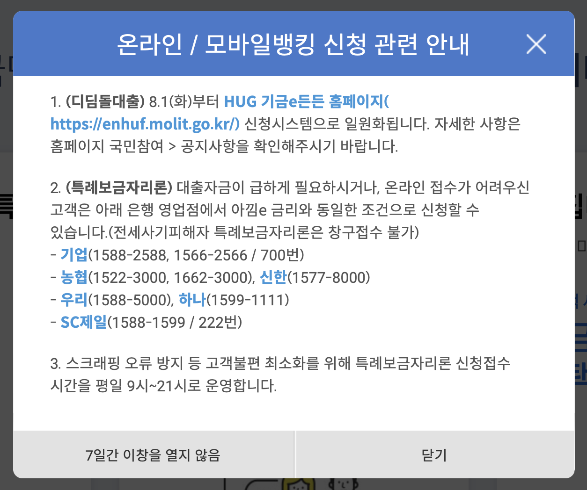

---
layout: post
title:  "2023년 디딤돌 대출 수탁은행은 그대로, 주택금융공사는 소진으로 중단"
author: fabi
categories: ["금융"]
image: assets/images/didimdol-loan-2/thumbnail.png
description: "주택금융공사 디딤돌 대출 소진, 수탁은행은 그대로인 정보를 공유드립니다."
featured: false
hidden: false
--- 

안녕하세요 파비입니다.
주택 구입 대출(매매대출)인 디딤돌 대출에 대해 [디딤돌대출](fabiryan.com/didimdol-loan) 페이지에서 상세히 설명을 드렸었는데요.
해당 내용에 올해 주택금융공사에서의 대출 실행은 중단된다는 새로운 뉴스가 있어 전달드리려합니다.

뉴스를 보니 마치 디딤돌대출이 앞으로 안된다! 이런 느낌으로 어그로성 글이 많아보이는데....
주택금융공사는 올해 디딤돌대출의 공급 계획인 4조4000억원이 모두 소진되면서 더는 디딤돌대출을 판매하지 않기로 했고, 이를 [주택도시기금 기금e든든](https://menhuf.molit.go.kr)으로 일원화 한다고 합니다. 
주택도시기금은 수탁은행에서 처리되기 때문에, 수탁은행은 그대로 판매를 진행하는 것입니다.

#### 정리하자면, 안되는거 아니고!! 아래 주택금융공사 페이지에서 보이듯 주택도시기금HUG을 통한 수탁 은행에서는 진행 가능합니다.

다만 디딤돌 대출은 한도가 2.5억밖에 되지 않기 때문에, 특례보금자리론을 동시에 사용해야하는 분들이 계실텐데요. 디딤돌 대출은 [기금e든든](https://menhuf.molit.go.kr)에서 처리하고 특례보금자리론은 [주택금융공사](hf.go.kr)에서 진행하다 보니 다소 불편함은 겪을 것 같습니다. 

# 수탁은행 
국민, 농협, 신한, 우리, 하나, 부산, 대구

&#35; 디딤돌 대출 # 생애 최초 주택 자금 대출 # 청년 디딤돌 대출 # 생애 최초 주택 구입 대출 # 신혼 부부 생애 첫 주택 대출 # 디딤돌 대출 한도 # 신혼 부부 디딤돌 대출