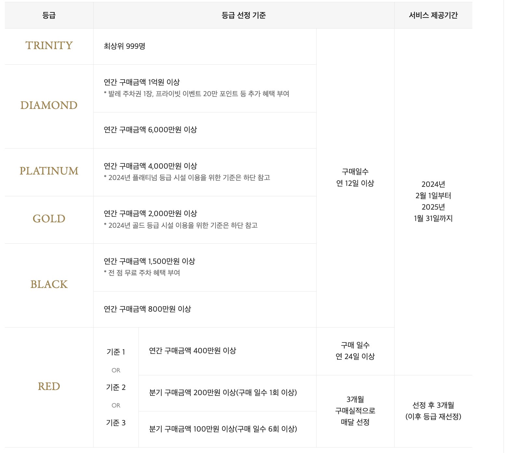
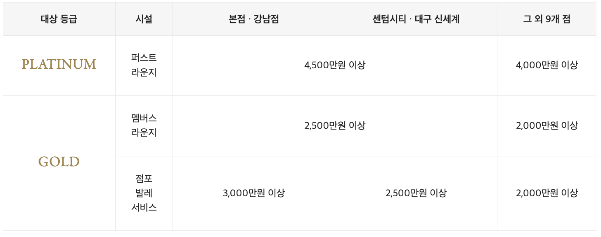
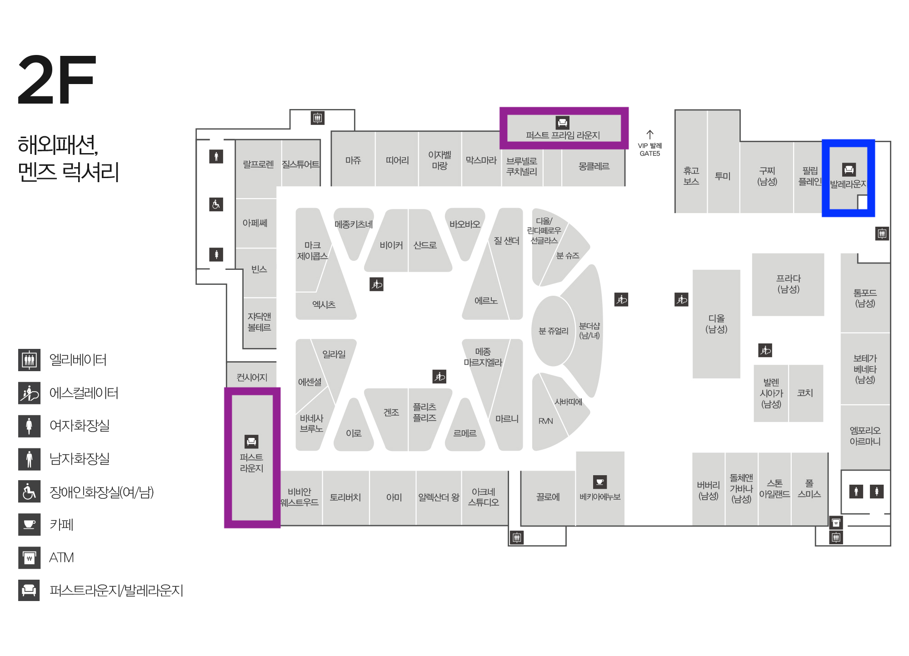
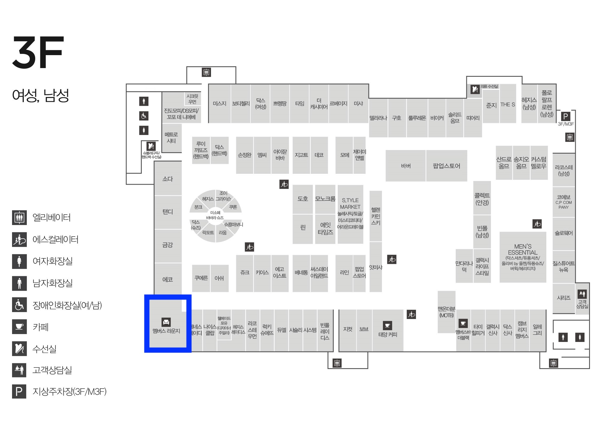
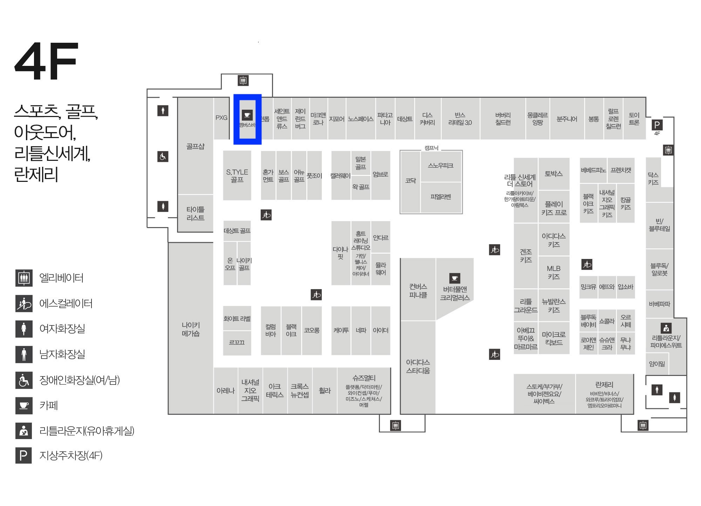

---
layout: post
title:  "신세계 백화점 vip 선정기준, 이용가능 시설, 대전점 시설 위치"
author: fabi
categories: ["금융"]
image: assets/images/shinsegae-vip/thumbnail.png
description: "신세계 백화점 vip 선정기준과 이용가능한 시설, 대전점의 시설 위치 정보를 공유드립니다."
featured: false
hidden: false
--- 

안녕하세요. 신세계 백화점 vip 파비가 여러분들께 신세계 백화점 vip 정보를 공유드리려합니다.
vip 선정기준과 vip 등급별로 이용가능한 시설을 공유드리려 합니다.
그리고 제가 애용하는 신세게 Art&Science(대전점)의 시설 위치 정보도 있습니다.

신세계는 웨딩 프로모션은 없다는 게 매우매우 아쉽지만... vip를 위한 세일리지 혜택을 다른 백화점처럼 존재합니다.

선정기준은 신세계 홈페이지에서 가져왔습니다

## 선정기준

## 이용가능 시설
vip의 등급별로 이용할 수 있는 시설이 다르다는 사실!!
저도 퍼스트 라운지 한 번 가보고 싶네요..ㅎㅎ
이것도 신세계 페이지에서 퍼왔습니다~

## 혜택
혜택은 등급별로 너무나도 상이해서 [신세계 페이지](https://www.shinsegae.com/service/vipclub/benefits-trinity_2023.do)에서 확인해주세요~

## 신세계 Art & Science 대전지점 시설 위치
- 퍼스트 프라임 라운지: 다이아몬드(연간 1억) 이상, 2층 몽클레르, 브루넬르 쿠치넬리 매장 사이
- 퍼스트 라운지, 퍼스트 프라임라운지 : 플레티넘(연간 4천) 이상, 2층 비비안웨스트우드 매장 옆 
- 점포 발레 서비스: 골드(연간 2천) 이상, 주차장 2층에서 발렛 서비스가 있으며 구찌, 필립플레인 옆 발렛 라운지와 연결됩니다.

- 멤버십 라운지: 골드 등급 이상, 3층 케네스 레이디 옆

- 멤버스바: 모든 등급, 4층 골프샵 매장 옆
 

