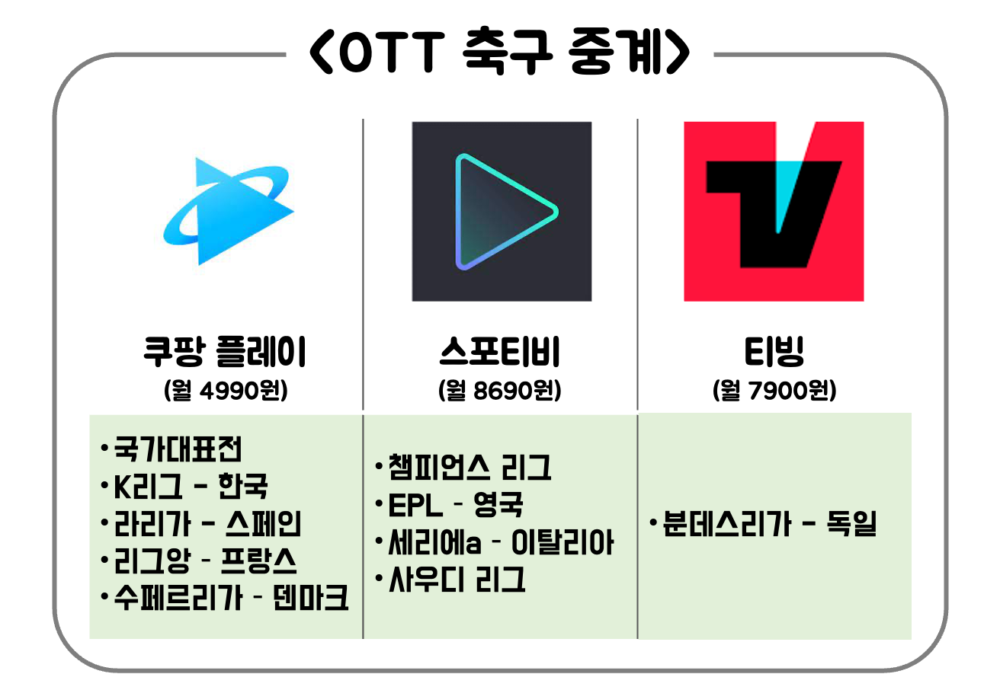
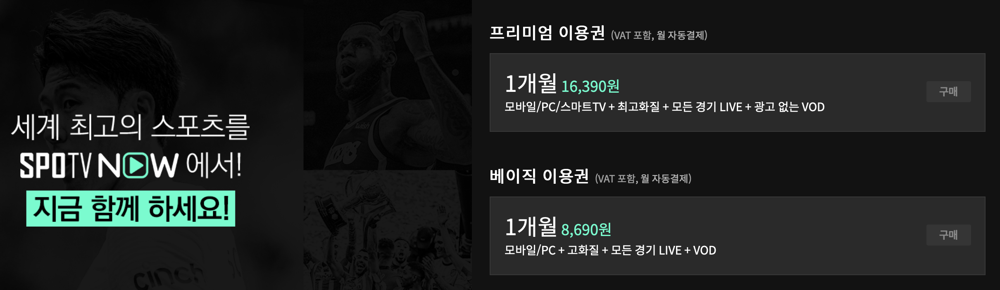
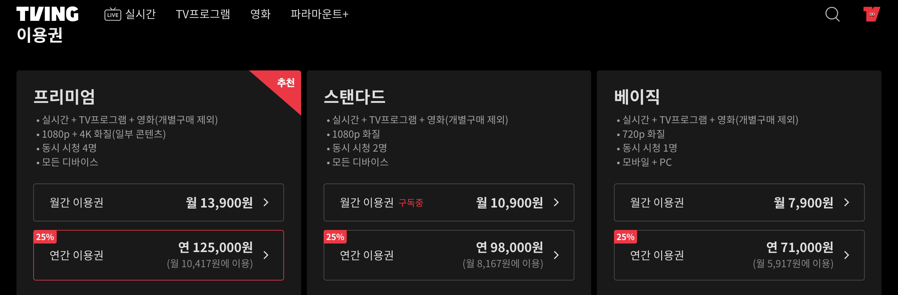

---
layout: post
title:  "OTT 별 축구 중계 리그 정보, 구독료: 쿠팡플레이, 스포티비, 티빙"
author: fabi
categories: ["미디어"]
image: assets/images/ott-football/thumbnail.png
description: "OTT 별 축구 중계 리그 정보를 공유합니다. 쿠팡플레이, 스포티비, 티빙의 중계 리그와 구독료를 한 눈에 비교해보세요 "
featured: false
hidden: false
--- 

OTT 별 축구 중계 리그 정보를 공유합니다. 쿠팡플레이, 스포티비, 티빙의 중계 리그와 구독료를 한 눈에 비교해보세요! \
안녕하세요! 어제 23년 7월 30일 **쿠팡플레이**에서 챔스에서나 볼 법한 **맨시티 vs AT 마드리드**의 경기 보셨나요? \
지난 22-23시즌까지만 해도 SPOTV 하나면 웬만한 리그를 다 볼 수 있었는데, 올해는 중계권이 OTT 마다 너무나도 상이해서.. 이것저것 구독해야하는 슬픈 현실입니다 ㅜㅜ \
그래서 제가 오늘 OTT 별로 어떤 리그가 중계되는지 정리해드리려고 합니다. 

# 축구 중계 OTT
많이 사용하는 OTT 중에서 축구리그 중계를 세 가지 추려봤습니다.

쿠팡플레이, SPOTV NOW, TVing입니다. \
아래 표에서 구독료와 어떤 리그가 포함되어 있는지 내용 보시죠.

# 쿠팡플레이
저도 이번 시즌부터 라리가를 보기 위해 지난달에 가입을 했습니다. \
그리고 국가대표전은 물론 방송국에서 해주는 경우가 많지만 쿠팡플레이에서 중계권을 갖고 있었다는 걸 알게되었네요. \
**이강인**이 있는 프랑스 리그 리그앙도 쿠팡플레이에 있네요. \
그리고 8/3 이강인과 전북현대의 프리시즌 경기를 보시고 싶으시다면 지금 가입하면 좋을 것 같네요. \
그리고 이제 **조규성** 선수가 덴마크 리그에서 출전합니다. \

쿠팡플레이 구독은 가격도 4990원으로 제일 저렴하고, 로켓와우에 쿠팡이츠 혜택까지 있으니 쇼핑과 배달을 자주 이용하는 분들에게는 구독하는게 이득인 듯 하네요.

"위 로켓와우 가입 배너는 쿠팡 파트너스 활동의 일환으로, 이에 따른 일정액의 수수료를 제공받습니다."

## 스포티비 나우
스포티비는 챔피언스리그와 EPL이라는 가장 큰 경기를 가지고 있습니다. \
다만 구독료가 비쌉니다.. 혹시 스마트 TV를 꼭 이용해야한다 하신다면 저 베이직 구독료로도 안됩니다. \
스마트TV 이용을 위해서는 프리미엄 구독료 16390원 입니다. \

## 티빙
티빙은 분데스리가 독일의 경기를 보실 수 있습니다. \
분데스리가 경기에 작년까지는 관심이 없었는데.. \
올해는 **김민재!!**선수가 뮌헨에서 뛰고 있기 때문에 구독을 할 가치가 있어보이네요. \
저도 지난 달부터 티빙을 구독하기 시작했습니다. \
티빙에는 다른 재밌는 오리지널 예능프로그램들도 많으니 손해는 아닌 것 같아서..ㅋㅋ \
티빙도 스마트TV 이용을 위해서 스탠다드 급(월 10900원) 이상으로 이용해야 합니다 ㅠㅠ

# 개인적인 파비의 구독 현황
저는 지난 22-23 시즌에는 스포티비 나우만 사용하고 있었는데요. \
23년 7월 31일 현시점, 쿠팡플레이와 티빙만 구독하고 있습니다. \
먼저, 아직 프리시즌이어서 쿠팡플레이를 통해 프리시즌을 즐기기 위함이 있구요. \
또, 토트넘에게는 너무나 죄송하지만 EPL은 잠시 포기하고 이강인 선수(쿠팡)와 김민재 선수(티빙)의 경기를 챙겨보려고 함입니다. \
그리고 스포티비는 챔피언스리그 8강 이후부터 다시 구독할까 싶어요.

그럼 오늘도 유익한 정보되었길 바라며 댓글이나 질문 환영입니다!
좋은 하루 보내세요 >_-

&#35; 해외축구 # 중계 # 해축 # 축구 생중계 # 프리미어 리그 중계 # epl 중계 # 라리가 중계 # 분데스리가 중계 # 조규성 # 이강인 # 손흥민 # 토트넘 # 김민재 