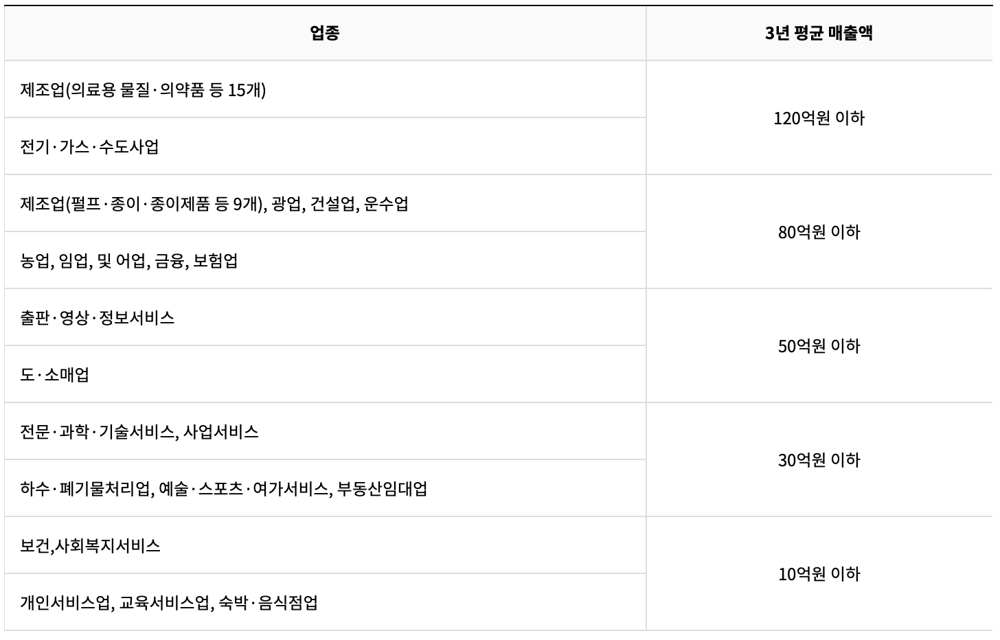
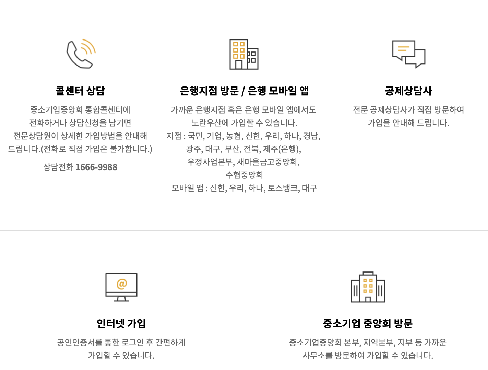

---
layout: post
title:  "노란우산 1탄 가입편 - 소상공인 소기업을 위한 퇴직금 마련 상품"
author: fabi
categories: ["금융"]
image: assets/images/yellow-1/thumbnail.png
description: "소기업·소상공인이 폐업이나 노령 등의 생계위협으로부터 생활의 안정을 기하고 사업재기 기회를 제공받을 수 있도록 중소기업협동조합법 제 115조 규정에 따라 운영되는 사업주의 퇴직금(목돈마련)을 위한 공제제도 입니다."
featured: false
hidden: false
--- 

노란우산은 소기업·소상공인의 생활 안정에 기할 수 있도록 중소기업협동조합법 제 115조 규정에 따라 운영되는 <u>사업주의 퇴직금(목돈마련)을 위한 공제제도</u> 입니다.

저희 엄마도 자그마하게 사업을 하실 때, 노란우산 통해서 저렴하게 대출을 이용하셨구요. 게다가 폐업할 때 퇴직금처럼 목돈을 챙기셨거든요. 폐업하실 때 조금이라도 더 넣지 않은 걸 엄청 후회하셨습니다.

그래서 소상공인·소기업 여러분들이 대출이나 폐업시에 혜택 받으실 수 있도록 오늘 노란 우산 가입에 대해 소개해드리려고 합니다.

#### 노란 우산은 적립한 금액을 복리 이자를 적용해 폐업 시 모두 가져가실 수 있습니다. 지금 잠깐 10만원 적금을 붓는 게 부담스러우시더라도 폐업할 때 정말 큰 도움이 되기 때문에 추천 드립니다!

# 노란우산
- 가입대상: 소기업·소상공인 개인사업자 또는 법인대표자
- 납부액: 월 5~100만원, 월납 또는 분기납
- 혜택
    - 폐업시 복리 이자 적용하여 목돈 마련
    - 연간 최대 500만원 소득공제
    - 납부액에 대한 **대출**을 통한 자금활용
    - 무료 상해보험 가입

## 가입대상
사업체가 소기업·소상공인 범위에 포함되는 개인사업자 또는 법인의 대표자 \
※ 단, 비영리법인의 대표자 및 가입제한 대상에 해당되는 대표자는 가입 불가

## 노란우산 제도
1. **공제금에 대한 수급권 보호**: 공제금은 압류, 양도, 담보제공이 금지되어 있어 안전하게 생활안정과 사업재기를 위한 자금으로 활용 가능
2. **연간 최대 500만원 소득공제**: 납부한 부금액에 대해서는 기존 소득공제상품과 별도로 최대 연 500만원까지 추가로 소득공제
3. **일시/분할금으로 목돈 마련**: 납입한 원금 전액 적립 및 **복리이자**를 적용으로 폐업 시 목돈 마련 가능
4. **공제계약 대출(부금내 대출)을 통한 자금 활용**: 공제부금 납부를 연체하고 있지 않은 가입자는 임의해약환급금의 90% 이내에서 대출기간 1년(연장가능), 대출이자 3.8%의 조건으로 대출 가능
5. **무료 상해보험 가입**: 상해로 인한 사망 및 후유장애 발생 시 2년간 최고 월부금액의 150배까지 보험금이 지급되며, 보험료는 중소기업중앙회가 부담

## 부금 납부 방법
- 월납기준 5만원부터 100만원까지 1만원 단위
- 월납 또는 분기납
- 자동이체로만 납부 가능: 기업, KEB하나, 우리, 농협, 국민, 신한, 씨티, SC제일, 제주, 광주, 대구, 부산, 경남, 산업, 전북, 우체국, 신협중앙회, 새마을금고중앙회, 토스뱅크

### 소상공인 기준 업종별 소득
본인의 업종에 맞추어 매출액을 확인하시어 소기업, 소상공인에 포함되는지 확인하세요.

해당 이미지는 [노란우산](https://www.8899.or.kr/yuma/contents/contents/contents.do?mnSeq=24) 페이지에서 퍼왔습니다.
- 가입제한 업종\
일반유흥주점업(산업분류 56211), 무도유흥주점업(산업분류 56211), 식품위생법시행령 제21조에 따른 단란주점업, 무도장 운영업(산업분류 91291), 도박장 운영업(산업분류 91249), 의료행위 아닌 안마업(산업분류 96122)

- 가입제한 대상자\
부금연체 또는 부정수급으로 해약처리 된 후 1년이 지나지 않은 대표자

- 여러사업체가 있다면?\
한 사업체만 선택하시어 가입할 수 있습니다

-  무등록 소상공인도 가입가능? \
등록된 사업자는 아니나 사업사실 확인이 가능한 인적용역제공자도 가입이 가능

# 가입 방법
- [인터넷 가입 바로가기](https://www.8899.or.kr/yuma/login/main_login.do?mnSeq=203) 
- 중소기업 중앙회 방문 가입: [지역본부 위치/전화번호 바로찾기](https://www.8899.or.kr/yuma/contents/contents/contents.do?mnSeq=181)

모든 자료는 [노란우산 홈페이지](https://www.8899.or.kr/yuma/index.do)를 참고하였습니다.