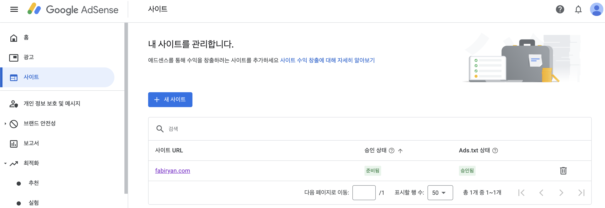
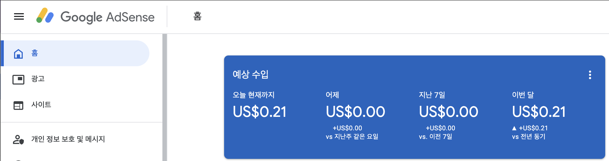

---
layout: post
title:  "구글 애드센스 사이트 준비중 - 기다림의 연속"
author: fabi
categories: ["IT"]
image: assets/images/adsense-prepared/thumbnail.png
description: "구글 애드센스를 적용한 파비. 사이트 준비중에서 준비됨이 되기까지 걸린 시간 2주."
featured: false
hidden: false
--- 

안녕하세요 파비입니다.
모두들 운영중인 블로그에 구글애드센스를 넣으셨나요?
애드센스는 구글에서 제공하는 광고 중간 플랫폼입니다.
[구글 애드 센스 홈페이지](adsense.google.com)를 통해 가입하고, 본인의 블로그에 광고를 삽입하면 블로그 수익화를 시작할 수 있는데요.

제가 2022년에 블로그를 시작하고서 애드센스를 넣은 적이 있었는데, 그 때 도메인은 폐기하고 새롭게 이 블로그를 개설한 건데요.

새롭게 블로그를 개설했기 때문에 애드센스도 새롭게 제출하였습니다.

그런데 사이트에 끊임없이 무한한 "준비중"의 시간이 계속되었는데요.

광고가 되면 삶에 아주 작은 콩고물이라도 떨어지지 않을까 하는 기대감에 오매불망 준비중 상태가 끝나기를 기다렸습니다.

### 마침내! 2주 만에 사이트 준비중이 준비됨으로 바뀌었어요!

저처럼 준비중이 계속되어서 걱정하시고 계신분들, 뭔가 내가 잘못한 게 아닌가 다시 제출할까 고민하시는 분들 많으실텐데요.

인터넷 검색을 해보니 6개월이 걸렸다는 분들도 계시더라구요!!ㄷㄷ..

저는 그나마 포스트가 많아서 빨리 된 게 아닐까 조심스레 추측하고 있습니다.

또, 애드센스 안에 구글 애드센스 되는법 유튜브영상이 뜨는데요.(어떤 백인 남성이 설명해줍니다. 자막이 있으니 걱정마세요!) \
해당 내용에서 얘기하는대로 다른 블로그의 글을 복붙하지 않고 저만의 포스트들을 많이 써서 기다리니 된 것 같습니다.

또 구글 서치 콘솔에서 문제되는 요소들을 알려주잖아요. 거기서 나오는 경고들도 모두 없애주었더니 빨리 된 게 아닐까 추측해봅니다. 그저 뇌피셜입니다..

여튼 이제 저도 블로그 수익화의 시작입니다. 지금까지 0.2달러 250원!!!
이렇게 4번이면 껌은 사먹을 수 있지 않을까요!!!?? 

### 블로그 수익화를 기대하는 모든 여러분을 파비가 응원합니다! >_- 파이팅!

&#35; 애드 센스 홈페이지 # 구글 애드 센스 # 애드 센스 가입 # google 애드 센스