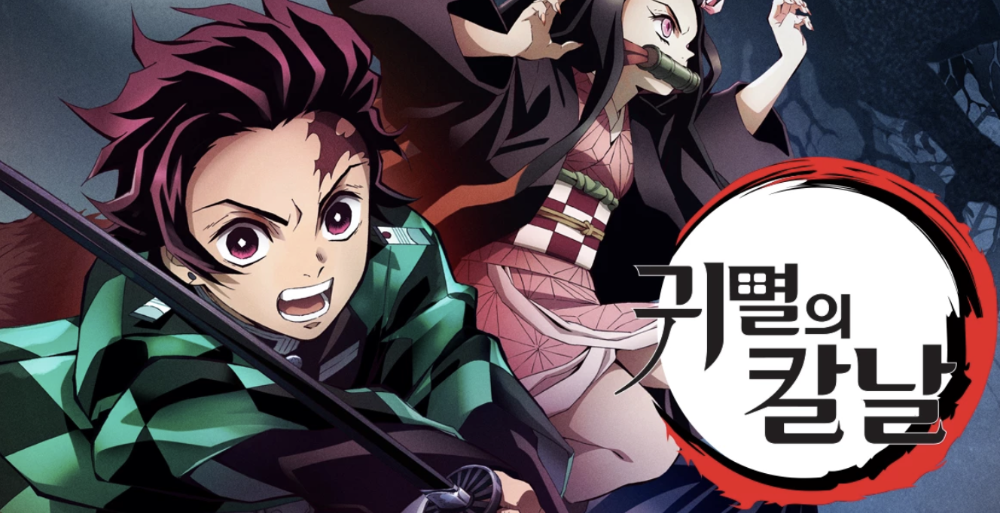
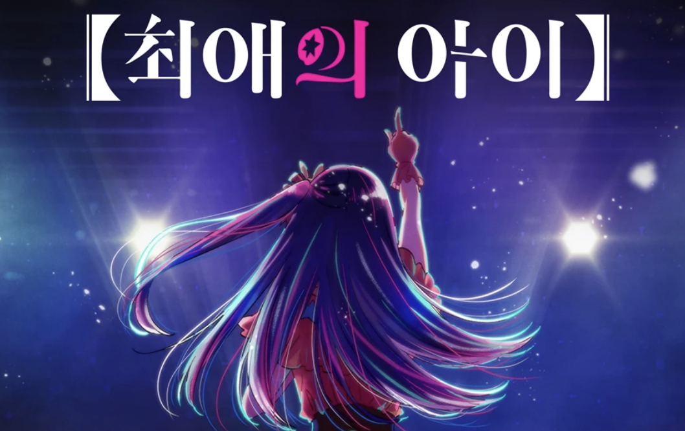
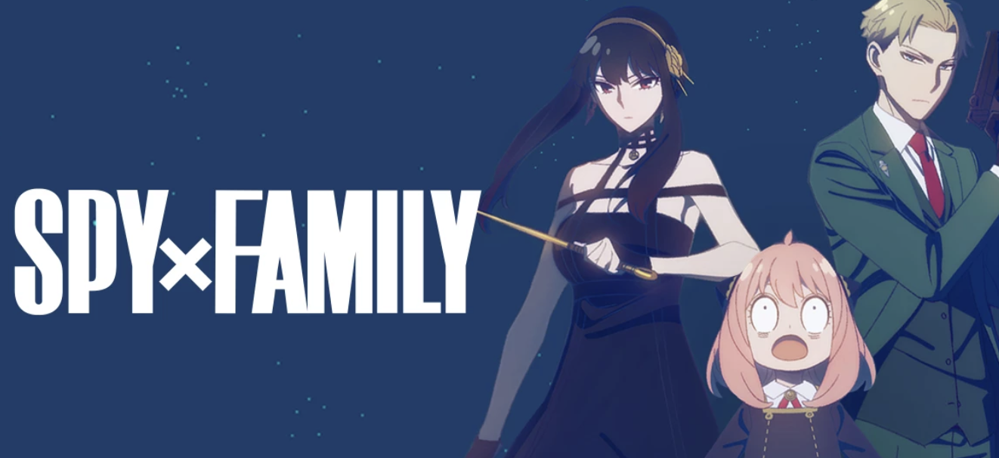
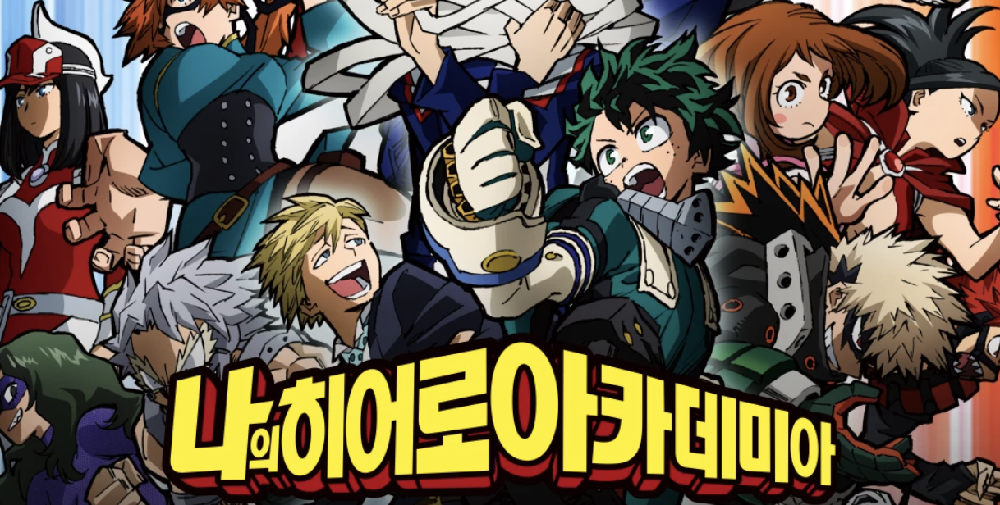
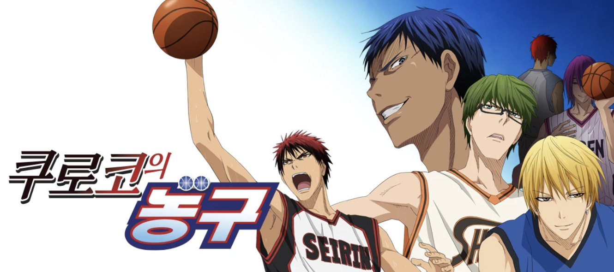
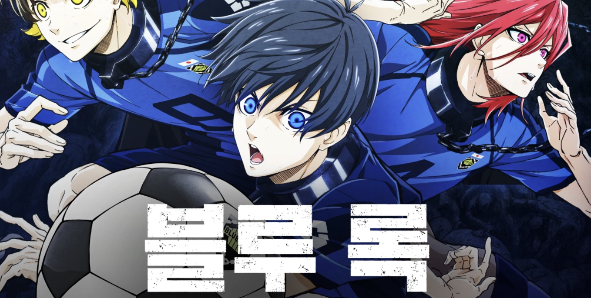
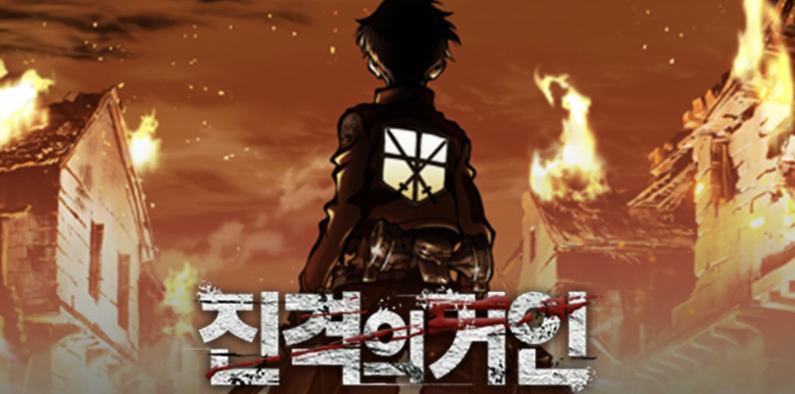
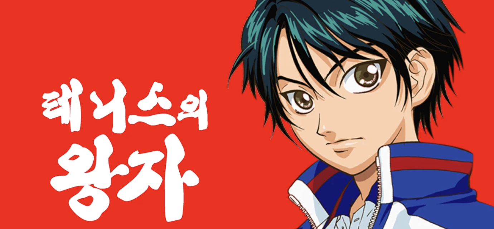
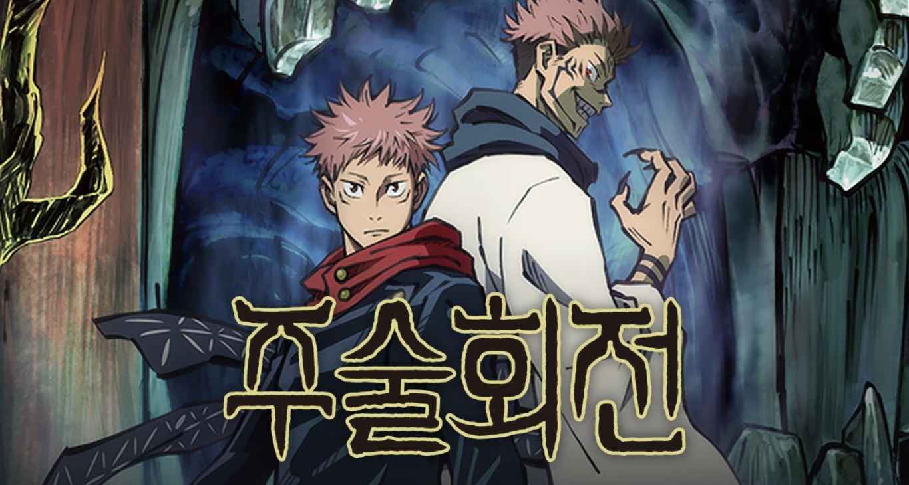
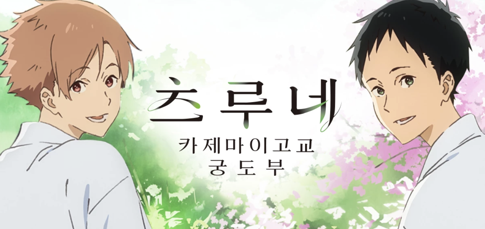

---
layout: post
title:  "티빙 애니 추천 10선 - 판타지.스포츠.좀비.미스테리.학원물."
author: fabi
categories: ["미디어"]
image: assets/images/tving-ani/thumbnail.png
description: "티빙의 애니메이션 작품을 추천 드립니다. 판타지, 좀비, 미스테리, 학원물, 이세계 등 두루두루 추천드릴게요. 모두 즐거운 미디어 생활 되시길 바랍니다."
featured: false
hidden: false
--- 

안녕하세요 파비입니다. 오늘은 2023년 기준 티빙의 애니 작품들을 추천드리려 합니다.
티빙에는 정말정말 많은 애니가 있더라구요? \
그 중에서 제가 재밌게 봤던 작품 10선을 공유드리려 합니다. \
여러분들도 재밌게 보신 작품이 있다면 댓글로 알려주세요 >_-

1. 귀멸의 칼날

일종의 좀비물입니다.
오니라고 불리는 인간을 먹는, 그러나 일반적인(?) 좀비와는 다르게 대화도 가능한 지적 생물체와의 싸움을 다룬 애니입니다. \
현재 1기~3기까지 제작되었고, 티빙에 모두 있습니다. \
여자 주인공인 네즈코의 귀여움에 빠질 수 밖에 없는 작품!ㅠㅠ \
만화는 이미 완결이 난 작품이라서 앞으로 4기 혹은 5기까지 하고 끝날 예정인 작품입니다.\
무엇보다 애니메이션의 퀄리티가 아주 끝내줍니다.

2. 최애의 아이

2023년 가장 핫한 애니입니다. 마치 아이돌에 대한 이야기로 생각될 수 있겠지만 장르는 미스테리입니다. 아이돌에 대한 이야기를 두루두루 다루지만 엄마의 죽음을 파헤치는 스토리라는거! \
아직 원작도 완결이 나지 않은 현재 진행중인 작품입니다. \
애니는 1기밖에 아직 제작되지 않아서, 나중에 몰아보실 분들은 좀 더 기다리기를 추천드립니다. \
저는 악간.... 뒤로갈수록 집중하기 힘든 손발 오그라듬을 느끼긴 했습니다. 

3. 스파이 패밀리

2022년 가장 핫한 애니가 아녔을까요. 작가가 오랜 기간 어렵게 작가 생활을 하다가, 드디어 성공을 한 작품으로 유명하죠. (그런데 이 작품에 애착이 많지 않다는 후문..) \
제목 그대로 스파이물입니다.
한 가정을 이루고 있는 엄마, 아빠, 딸, 강아지가 서로에게 비밀이 있는 귀염뽀짝, 말랑말랑한 애니입니다. \
원작 만화는 아직 완결되지 않았고, 현재 애니메이션은 파트2까지 제작되었으며 티빙에 더빙, 자막판 모두 있습니다. \
가볍게 보기에 코믹하고 재미집니다. 

4. 나의 히어로 아카데미아

나의 히어로 아카데미아는 아직 원작 만화가 완결이 나지는 않았지만, 현재 최종장에 있는 끝나기 직전의 작품입니다. \ 
제목 그대로 특별한 능력을 가진 히어로들과 빌런 간의 싸움을 다룬 내용입니다. \
현재 제작된 1기부터 6기까지의 애니메이션이 더빙, 자막판 모두 티빙에 있습니다. \
가장 최근 제작된 6기는 좀 침울하긴 한데요 ..ㅠㅠ \
특히 1~4기가 아주 흥미로운 학원물, 히어로물의 내용이 다뤄집니다. 

5. 쿠로코의 농구

쿠로코의 농구는 완결이 난 작품이며 티빙에 모두 있습니다! 학원물이자 스포츠물이라고 할 수 있겠습니다. \
일본 애니메이션은 스포츠를 다룬 작품이 워낙 많은데요. 슬램덩크 이후 가장 호평을 받은 농구 만화가 아닐까 싶습니다. \ 
환상의 식스맨이라고 불리는 쿠로코가 주인공인 농구 만화, 추천드립니다.

6. 블루 록

농구를 추천드렸다면 이번엔 축구를 추천드려볼게요.
블루 록도 아쉽지만 완결은 아직 나지 않았습니다. \
축구는 22명 + 교체선수까지 너무 많은 등장인물이 필요한 작품이라 ㅋㅋ.. 지금까지 이렇다할 재미진 작품이 없었던 것 같은데, 블루 록은 정말 잘 만든 작품입니다.
축구를 좋아하는데, 애니도 좋아한다면 추천드립니다. 

7. 진격의 거인

이제는 고전이라고 봐도 될 듯한 진격의 거인.
완결이 났으며, 모든 시즌이 다 티빙에 있습니다. \
식인 거인이 팽배한 세상에 인간이 살 수 있는 땅은 아주 조그마한 설정인데요. \
거인과의 싸움과 거인이 생겨난 배경에 대해 점차 알아가는 판타지.미스테리.아주재미!! 있는 추추천 작품입니다. \
식인이라는 컨셉때문에 다소 그로테스크한면이 있긴 하지만 그렇게 심각하지는 않습니닼ㅋㅋㅋ.. 아주 흥미진진쓰 추천쓰

8. 테니스의 왕자

이거는 이제 거의 슬램덩크급 고전이긴 합니다만, 마다마다(아직) 안보셨다면 보시길 추천드립니다.\
중학생ㅋㅋㅋ들의 열정 터지는 테니스 만화입니다. \
테니스 천재 중1 소년 료마가 주인공이고 서브 남주들의 성장물입니다.\
오늘 유독 스포츠물 추천을 많이 드리네요.

9. 주술 회전

주술 회전은 아직 완결이 나지 않은 인기 만화 원작 작품이며, 티빙에 2기까지 업로드 되어 있습니다.\
오늘 소개드리는 작품들 중 가장 그로테스크합니다. \
햇병아리 주술사들의 투쟁을 그린 작품입니다.
애니메이션 퀄리티가 좋은 편입니다. 그로테스크물을 잘 보실 수 있는 분들이라면 추천드립니다.

10. 츠루네

이세계물을 추천드려볼까 하다가.. 마지막도 스포츠물입니다.\
2023년에 방영된 그림체가 예쁜 츠루네 1,2기를 추천드리고 싶네요.\
방과후 활동인 궁도부에서(양궁과 비슷) 서로를 알아가며 성장하고 지역대회에 나가는 흔한 스포츠물입니다. \
스포츠물은 언제나 말랑말랑, 열정열정 즐겁지 않나요.

11. 그리고..
이 외에도 유명한 작품은 많습니다.
저는 이세계물을 즐기지 않아 10선에 넣지는 않았습니다만.. 2023년 올해 유행했던 '그녀가 공작저로 가야했던 사정', '전생했더니 슬라임이었던 건에 대하여', '전생했더니 검이었습니다' 등 인기 이세계물이 있습니다.
티빙에서 영화, 드라마만 즐기지 마시고 애니도 한번 도전해 보세요.

&#35; 티빙 애니 추천 # 귀멸의 칼날 # 최애의 아이 # 스파이 패밀리 # 나의 히어로 아카데미아 # 쿠로코의 농구 # 블루 록 # 진격의 거인 # 테니스의 왕자 # 주술 회전 # 츠루네 # 그녀가 공작저로 가야했던 사정 # 전생했더니 슬라임이었던 건에 대하여 # 전생했더니 검이었습니다 # 2023 애니 추천 # tving 애니 추천