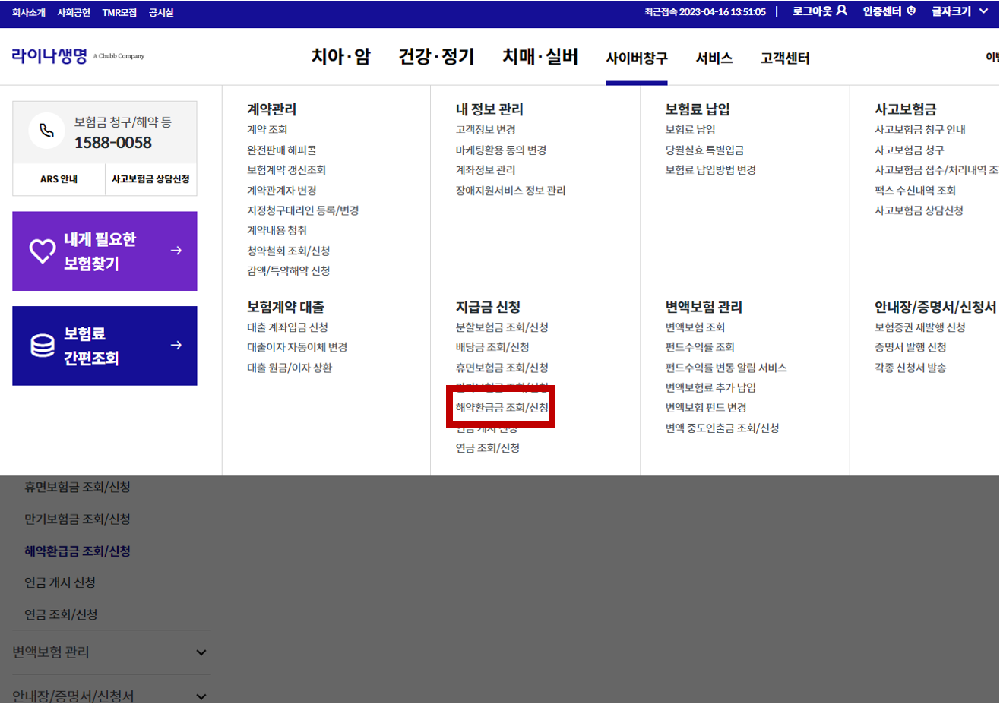

---
layout: post
title:  "라이나 생명 보험 해지 방법"
author: fabi
categories: ["금융"]
image: assets/images/lina-cancel/thumbnail.png
description: "라이나 생명 홈페이지에서 해지하는 방법을 공유합니다. "
featured: false
hidden: false
--- 

라이나생명 보험을 상담원 없이 [공식 홈페이지](https://lina.co.kr)에서 취소하는 방법입니다.

내 보험 계약을 뜯어봐 봤자 거기에 있는게 아니더라구요 ㅠ.ㅠ 저도 해지하는 데 애먹었습니다.

그림에서 보이듯이, **사이버 창구-해약환급금 조회/신청** 버튼을 누르시면 됩니다.

가입 중인 계약이 나오고, 해약 환급금을 조회한 후, 계좌번호 입력해서 해지 반환금을 받으면, 자동으로 해지까지 모두 처리됩니다.

오늘도 좋은 정보 드렸길 바라며, 좋은 날 보내세요 :)